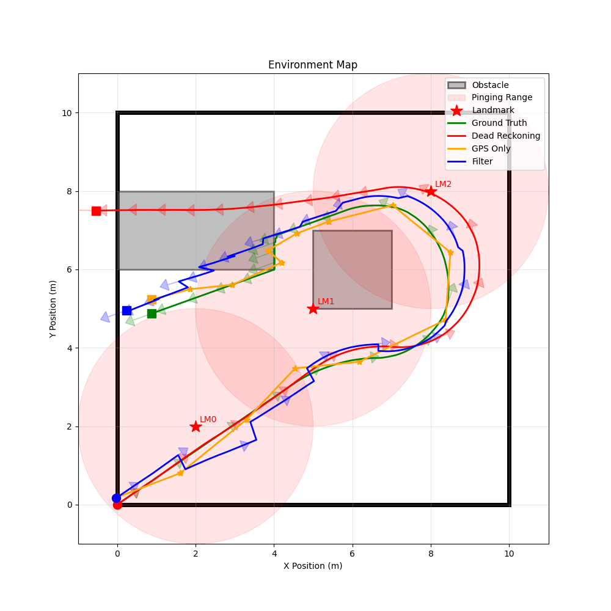
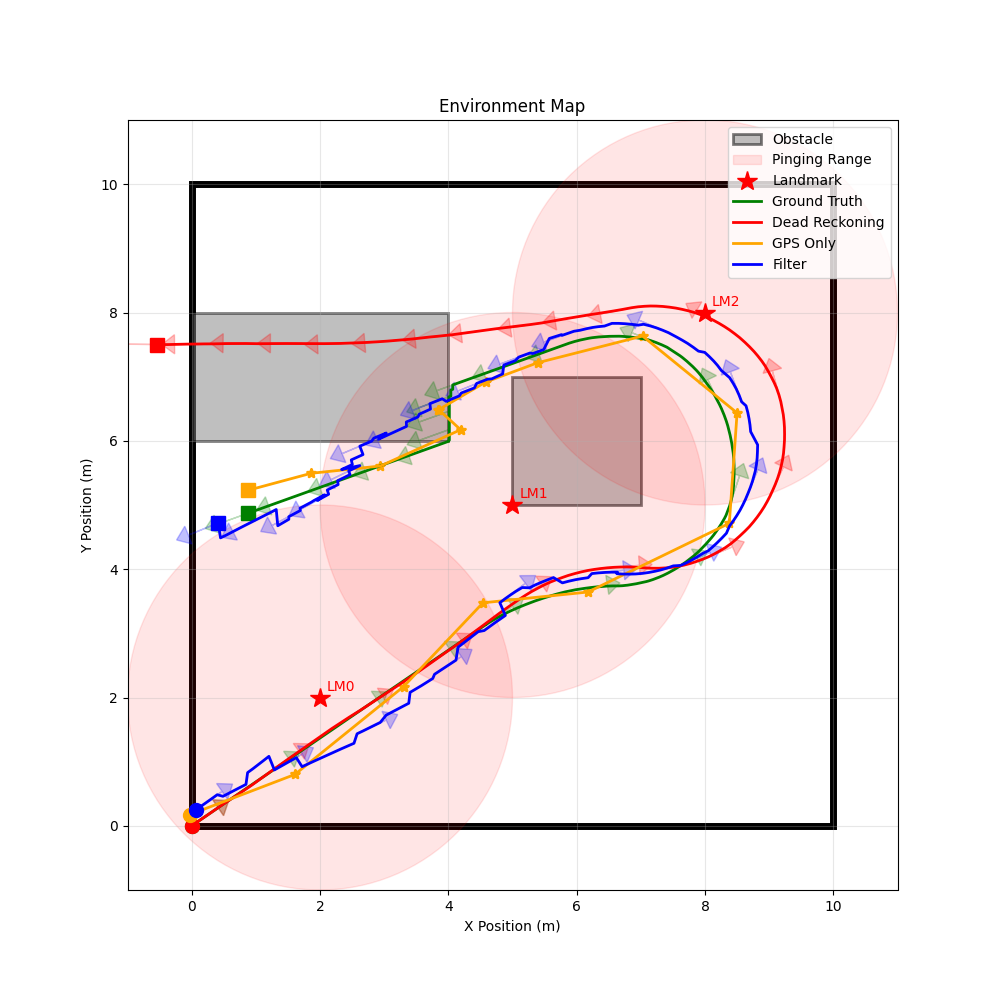

# Probabilistic Robotics Playground: Linear and Extended Kalman Filtering
**Developed by Dokyun Kim**


## Repository Overview
This repository contains a 2D simulation environment used in the _Probabilistic Robotics_ course at Olin College of Engineering. This branch contains an implementation of both a Linear Kalman Filter and an Extended Kalman Filter for state estimation of a robot navigating in a 2D environment. The simulator generates synthetic sensor data, including GPS and landmark measurements, which are used to evaluate the performance of the filters.

## File Structure
```bash
├── src/
├── input/
├── output/
├── requirements.txt
├── pyproject.toml
├── README.md
```

`src` contains the source code for this project.

`input` contains example input files that configure the simulator.

`output` contains output files generated by the simulator.

## Getting Started
1. Clone the repository and navigate to the project directory:

   ```bash
    git clone https://github.com/dokyun-kim4/2d_robot_sim.git
    cd 2d_robot_sim
   ```
2. Switch to the `week1` branch:

   ```bash
    git checkout week1
   ```
3. Install the required dependencies. This project uses `uv` for dependency management, but you can also use `pip` to install the dependencies directly from the `pyproject.toml` file:

   ```bash
    # Using a venv is recommended
    python -m venv .venv
    source .venv/bin/activate  # On Windows, use `venv\Scripts\activate`
    pip install .

    # OR using uv
    uv sync
   ```

4. Run the simulator for Linear KF or Extended KF:

   ```bash
    # For Linear KF
    python3 src/main.py --input_commands ./input/swerve_vel_cmd.csv --config ./input/config.yaml --drive_type 1
    
    # For Extended KF
    python3 src/main.py --input_commands ./input/diff_vel_cmd.csv --config ./input/config.yaml --drive_type 0
    ```
5. The simulator will generate output files in the `output` directory, including the a visualization of the robot's trajectory and state estimates.

## Sample Output

### Linear Kalman Filter
<image src="media/kf_output.png" alt="Linear KF Output" width="500"/>

The plot above shows the true trajectory of the robot (green), the trajectory from dead reckoning, the trajectory estimated by the Linear Kalman Filter (blue), GPS observations (orange), and the landmarks (star). Since the landmark measurements are nonlinear, the Linear KF only uses the GPS information to update its state estimate. As a result, the Linear KF trajectory is able to follow the true trajectory more closely than the dead reckoning trajectory, but its effects are not as obvious as there is no turning in the robot's trajectory.


### Extended Kalman Filter
 

The plot on the **left** shows the EKF trajectory when only GPS measurements are used for updates, while the plot on the **right** shows the EKF trajectory when both GPS and landmark measurements are used. Both plots also include the true trajectory of the robot (green), the trajectory from dead reckoning (red), GPS observations (orange), and the landmarks (star). 

We can see that with only GPS measurements, there are still noticeable differences between the EKF trajectory and the true trajectory, especially as time progresses. This is because GPS measurements alone may not be sufficient to correct for all the errors in the state estimate, particularly in scenarios where the robot is turning or when GPS measurements are noisy. 

When both GPS and landmark measurements are used, the EKF trajectory follows the true trajectory closer, demonstrating a significant improvement in estimation accuracy. This is because the landmarks provide additional information that helps to correct for errors in the state estimate, especially during turns or when GPS measurements are less reliable.
